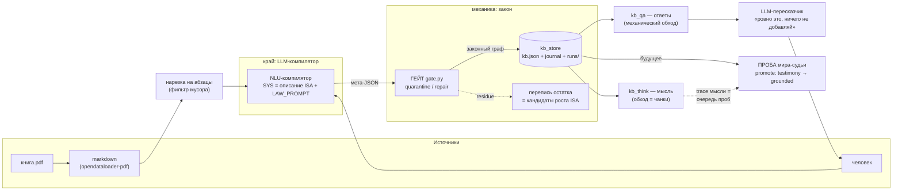
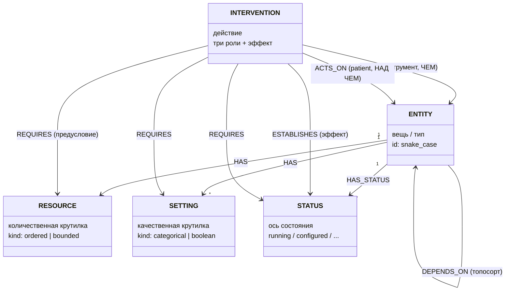
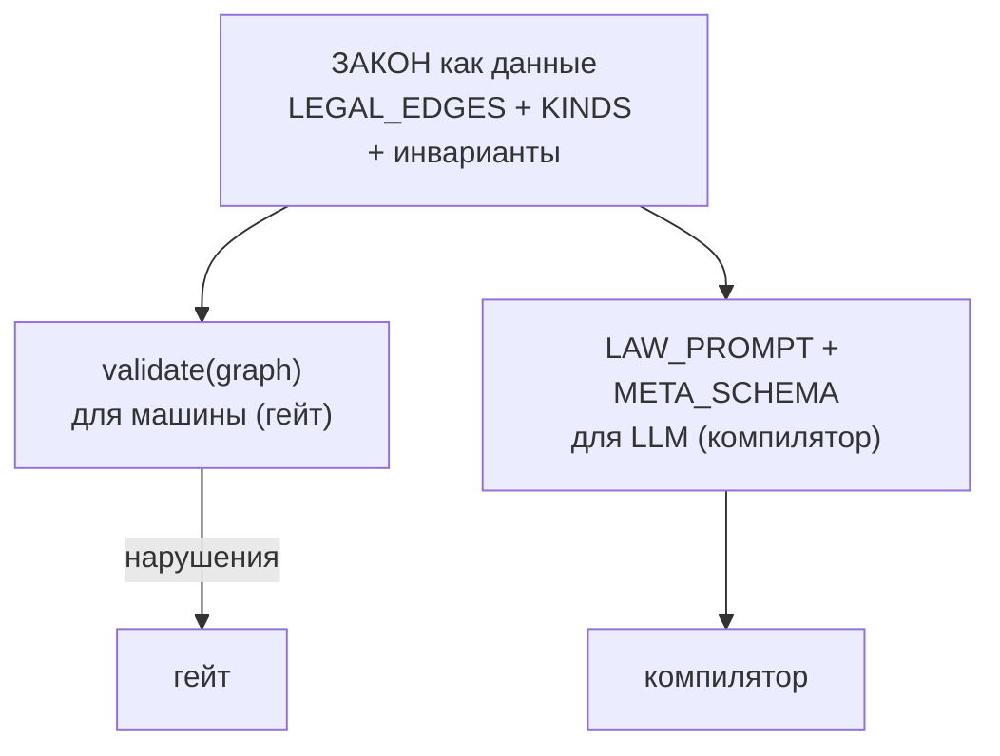
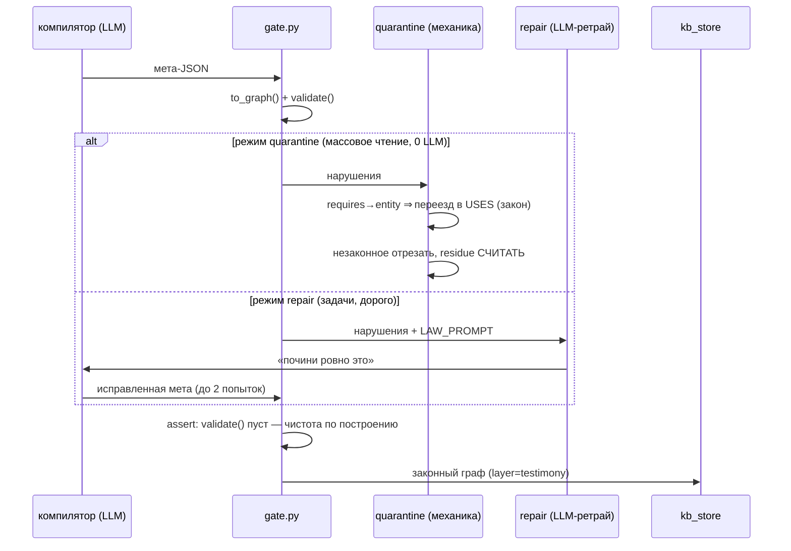
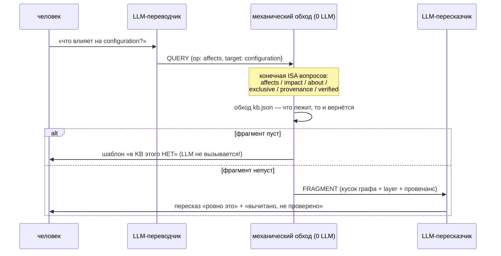

# V8 — Архитектура графа знаний (проверено на живых книгах)

*Состояние на 7 июля 2026. Всё описанное — не план, а работающий и обмеренный код
в `devops_agent/v8/`. Ветка: `v8_meta_kb` на github.com/VasyaLutiy/Puancare.*

---

## 1. Идея в трёх предложениях

Агент не понимает человеческий язык и не должен: у него есть **ISA — шесть мета-типов**,
как у процессора есть система команд. Внешняя LLM работает **компилятором** (человеческий
текст → строгая структура) и **пересказчиком** (кусок графа → человеческий ответ), а всё
знание живёт в **механическом графе**, где галлюцинация невозможна по построению.
Знание из текста — всегда «слухи» (testimony); в «проверенное» (grounded) его конвертирует
только **проба** реального мира — и это единственный конвертер.

> «Текст без пробы — это O(поверхностных форм) непроверенных показаний.
> Проба — не опция, а единственный конвертер слухов в знание.»

---

## 2. Пайплайн целиком



Ключевой принцип: **LLM только на краях, правда — в середине.** Обе течи, пойманные
за день, случились именно на краях (компилятор force-fit'ил болтовню; пересказчик
на пустом фрагменте сочинил «проверено пробой») — и обе заткнуты механикой, не промптом.

> «Middle не галлюцинирует никогда, края — при любой возможности;
> лечится не промптом, а сужением того, что краям доверено.»

---

## 3. ISA: шесть мета-типов и роли действия (UML)



Роли интервенции — главный урок ручной разметки (n=20, протокол Кирилла):

| роль | вопрос | пример: «настроить сервер ансиблом» | проба |
|---|---|---|---|
| `acts_on` | НАД чем? | server | уронил объект — действие не на чем совершать |
| `uses` | ЧЕМ? | ansible | уронил инструмент — действие деградировало |
| `requires` | какое СОСТОЯНИЕ нужно? | provisioned | не выполнено — действие не стартует |
| `establishes` | что стало ИСТИНОЙ после? | configured | наблюдаемый эффект |

До введения `acts_on` роль «НАД чем» была дырой ISA — и 60% рёбер `uses` оказались
объектами действий, втиснутыми в единственную доступную корзину. Дыра показана
данными, введена в закон — тот же путь, каким раньше выросли mutex/atmost.

Поверх графа — **логический слой** (оверлей, не раздувает граф):
`MUTEX(a,b)` — взаимоисключение; `ATMOST(members,B)` — общий бюджет.
В карантине ждут накопления residue: `if`-класс, `part-of` (композиция),
`CREATES` (действие создаёт вещь).

Эталонный результат трёхролевого компилятора (живой прогон, абзац про Ansible/Cobbler):

```
provision_bare_metal_servers: acts_on=[bare_metal_servers] uses=[network, pxe_standard] establishes=[provisioned]
configure_provisioned_servers: acts_on=[provisioned_servers] uses=[ansible] requires=[provisioned] establishes=[configured]
install_software_on_provisioned_servers: uses=[ansible] requires=[provisioned] establishes=[software_installed]
```

Действия сцеплены состояниями (`provisioned → configured → software_installed`) —
это готовый материал для планировщика.

---

## 4. Закон: один источник — два потребителя

Урок дня: закон жил в валидаторе, промпт компилятора — в другом файле со своей
ослабленной схемой; они разъехались, и 74% мет вошли в KB беззаконными.
Теперь закон записан **данными** в `contract.py`, и из одних таблиц генерятся оба
потребителя — разъехаться им больше не из чего:



Инварианты закона: каждая intervention обязана `establishes ≥1` (действие без
эффекта нелегально); resource/setting/status принадлежат объявленной entity;
`goal` ⊆ объявленных статусов; члены связок объявлены и однотипны.

---

## 5. Гейт: единственная дверь в KB



Residue — не мусор, а **сырьё роста ISA**: mutex/atmost когда-то выросли ровно из
residue старого гейта; `acts_on` — из ручной разметки uses-ведра; следующие
кандидаты (`CREATES`, `part-of`) уже копятся счётчиками.

---

## 6. Персистентная KB: знание не испаряется

```
devops_agent/v8/kb/
  kb.json         — материализованное состояние (узлы + рёбра, всё с провенансом)
  journal.jsonl   — append-only: что каждый прогон ДОБАВИЛ в знание
  runs/<id>.json  — сырой граф каждого прогона (воспроизводимость, след до абзаца)
```

Семантика merge:
- узлы сливаются по id, freq копится, у каждого — список источников `{run, freq, layer}`;
- **метатип узла = голосование** между прогонами: если `performance` в одной книге
  entity, в другой resource — спор не затирается, а хранится (votes) — расхождение
  ролей между контекстами само по себе знание;
- рёбра дедупятся по `(kind, from, to)`;
- **слои**: всё из текста — `testimony`, без исключений и без угадывания жанра;
  `grounded` — только через `promote(ids, probe_evidence)` с уликой-пробой.
  Понижения нет: grounded опровергается лишь новой пробой.

> «Слухи нельзя слить; проверенное — можно. Промоушен testimony→grounded
> оказывается заодно и механизмом дедупликации KB.»

Версии KB (все на диске, журнал полный): `kb_v1_lawless/` (беззаконная, 5560 узлов —
инфляция), `kb_v2/` (законная, 3496), `kb/` (v3, трёхролевая — текущая).

---

## 7. Разговор с графом: kb_qa



Вопрос вне ISA («agile лучше waterfall?») → честное «не понимаю» — неотвечаемое
видно сразу, а не замазывается болтовнёй. Пустой фрагмент до пересказчика **не
доезжает** — после того как LLM, получив `constraints: []`, сочинила и ответ,
и метку «проверено пробой». Это отличие от RAG по существу: RAG — вспоминалка
похожего текста, здесь — модель мира, отделяющая проверенное от услышанного.

---

## 8. Мысль агента: kb_think

Мысль = **обход собственного графа**; чанк мысли = один шаг обхода с эпистемической
пометкой. Ноль LLM — думание такое же механическое, как ответы.

```
[0] ЦЕЛЬ: configured — думаю по графу (всё testimony, пока проб не было)
[1]   чтобы получить configured — есть действие configure_servers (слухи, freq=2)
[2]     configure_servers совершается НАД provisioned_servers (слухи)
[3]     configure_servers использует инструмент ansible (слухи; проба: уронить ansible и смотреть)
[4]     configure_servers требует состояния provisioned → хочу provisioned
[5]       ...
```

Свойства, унаследованные от честной середины: обрывы видны («в KB нет пути»),
циклы ловятся (книга противоречит себе — мысль это вскрывает), и главное:

> «Очередь проб = trace мысли. Агент думает по слухам → мысль порождает список
> того, что надо проверить → пробы конвертируют путь мысли в проверенное знание.»

Так «чанки мысли» оказались не имитацией, а **генератором задач для пробы** —
недостающим звеном между полкой testimony и пустой полкой grounded.

---

## 9. Что намерено на живых книгах (629 абзацев, две книги)

Инварианты, пережившие смену закона (v1→v2→v3) — свойства testimony-знания,
а не артефакты схемы:

| измерение | значение | смысл |
|---|---|---|
| узлы freq=1 | ~83–84% | словарь текста не сходится: O(поверхностных форм), не O(типов) |
| межкнижные узлы | ~2.7% | пересеклись только родовые слова (system, infrastructure) |
| межкнижные рёбра | **0** | знание из двух источников НЕ срастается — только словари ссыпаются |
| нормализация «близнецов» | −5.8% | фрагментация семантическая, строками не лечится |

Находки об инструменте (LLM-крае), каждая — измерением, не мнением:

| находка | цифры |
|---|---|
| «различение жанра» — фраза в промпте, не свойство ISA | аблация: 9/9 → 0/9 пустых мет от одного предложения |
| связки из текста — в основном мусор | precision mutex 1/3 (n=3); 66% связок вне контракта |
| ужесточение закона давит мусор И сигнал разом | связки 206→7; пустые меты 16%→33% |
| одна LLM-проба на абзац недостоверна | тот же абзац: то пусто, то учебник (протокол дисперсии: `variance_roles.py`) |
| роль PATIENT отсутствовала | 60% uses-рёбер — объекты действий (ручная разметка n=20) |

Вывод, к которому всё сходится: **слияние знаний, дедупликация и проверка — все три
живут только за пробой.** Компилятор и книги дают гипотезы; истину даёт мир.

---

## 10. Карта файлов

| файл | что делает |
|---|---|
| `graph.py` | KnowledgeGraph одной меты: 5 типов узлов, 7 отношений, constraint-слой |
| `contract.py` | ЗАКОН как данные → validate() + LAW_PROMPT + META_SCHEMA |
| `gate.py` | единственная дверь в KB: quarantine / repair, assert чистоты |
| `constraints.py` | форма mutex/atmost + контракт логического слоя |
| `kb_store.py` | персистентная KB: merge, голосование, слои, promote, CLI-анализ |
| `kb_qa.py` | вопрос → QUERY → механический обход → пересказ |
| `kb_think.py` | чанки мысли = обратный вывод по графу (0 LLM) |
| `book_graph.py` | книга → абзацы → компилятор → агрегация |
| `learn_constraints.py` | добыча mutex/atmost пробой мира-судьи (A/B/D/E-стенд) |
| `experiments/` | драйверы прогонов, межкнижный разрез, Q&A до/после, протоколы разметки и дисперсии |
| `kb/`, `kb_v2/`, `kb_v1_lawless/` | KB v3 (текущая) и архивы для сравнения |

---

## 11. Открытые вопросы (честный список)

1. **Пересуппрессия**: законный компилятор молчит вдвое чаще (16%→33% пустых) —
   честность или потеря? Нужен семантический судья на размеченной выборке.
2. **Recall связок**: эталонный `rolled_out ⊻ rolled_back` погиб при ужесточении.
   Дозатор precision/recall не строится промптом — строится гейтом + голосованием
   нескольких компиляций.
3. **Унификация связок**: `atmost(bound=1)` + mutex-как-сахар — или раздельно
   (вопрос открыт с 29 июня).
4. **part-of / CREATES**: копятся в residue, ждут ввода в закон по накоплению.
5. **Мир-судья для книжного домена**: проба — единственный конвертер testimony→grounded,
   а мира-судьи для «DevOps-книжного» знания пока нет. Кандидат: синтетические миры
   NeMo + проекция книжных гипотез на них.
